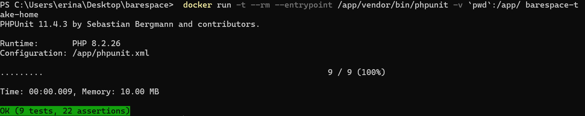

Please see below each case for my personal notes. I was unsure of how in depth to go, as the instructions don't go into much depth.

Build docker image
```
docker build -t barespace-take-home .
```
Install composer dependencies
```
docker run --rm -t -v `pwd`:/app/ -w /app barespace-take-home composer install 
```
Run PHPUnit tests
```
 docker run -t --rm --entrypoint /app/vendor/bin/phpunit -v `pwd`:/app/ barespace-take-home
 ```



## Case 1
Two sum Two


Array of values  = [2,11,7,15]

Target = 18

Instructions

Look for the two numbers that sum up to the target. Move the numbers in the Array

**I wasn't sure if the instructions were complete or not. I googled the question out of curiosity and found that it was a leetcode problem (I've never used their platform). 
Their instructions state to return a 2 length array that contains the indexes of the two numbers that add up to the target. I refactored last minute to return that instead of the two numbers. If I misunderstood the instruction or made some assumptions, I can certainly change it.**

## Case 2

Write a function to hide a credit card number

Instructions

A credit card usually contains 16 digits with an (*) asterisk and keeps its last four digits as is


Return the updated string with the first 12 characters replaced with asterisks (*).

**I may of missed something here, this seemed too straightforward?**

## Case 3
---
Write a function to move all zeros in the array to the end

Array = [0,1,0,3,12]

Instructions

Move all the zeros to the end of the array while maintaining relative order to the non-zero elements

**I didn't know if maintaining the array keys was important or not, but provided one solution that does maintain them. All solutions maintain element ordering.**